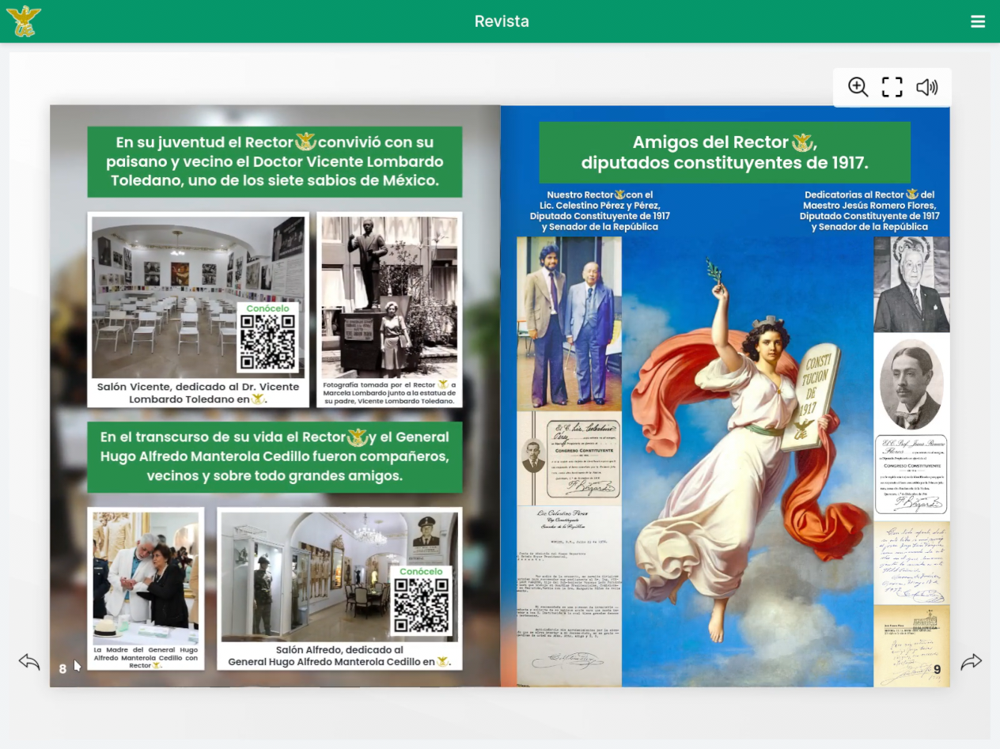
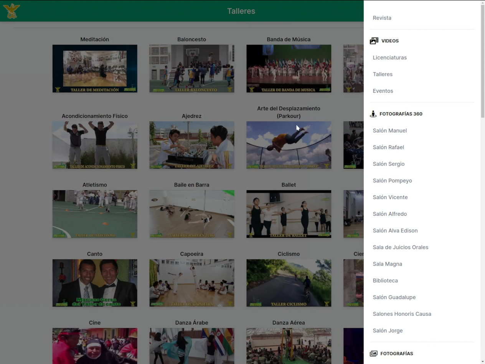
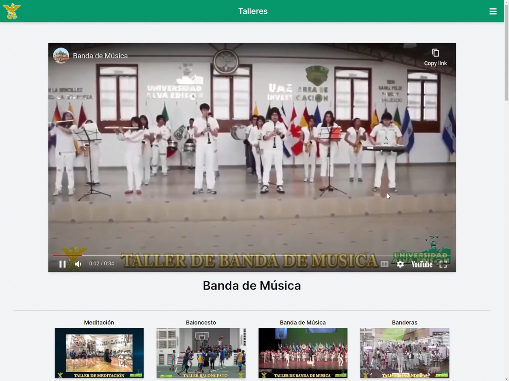

## Acerca del proyecto

Código fuente de la página web para la revista de la [Universidad Alva Edison](https://unialvaedison.edu.mx/), mostrando contenido multimedia como imágenes, videos y fotografías 360° acerca de la historia y datos de la universidad. Utiliza un sistema de códigos QR vinculados cada uno a una URL destinada a cierto contenido en concreto, de forma que proporcione una interacción fluida entre la revista física y el sitio web.

## Capturas

